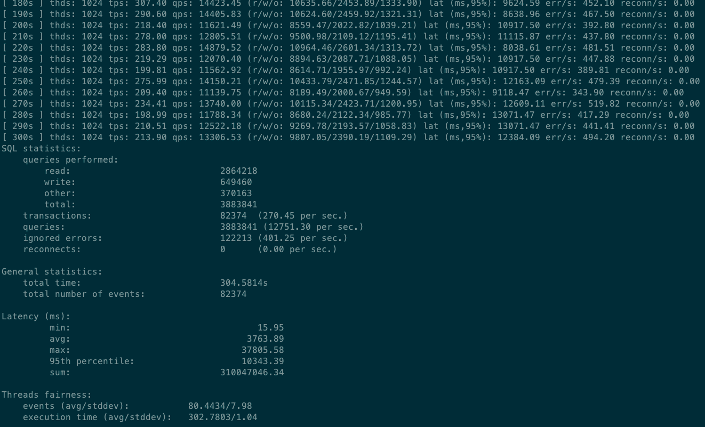
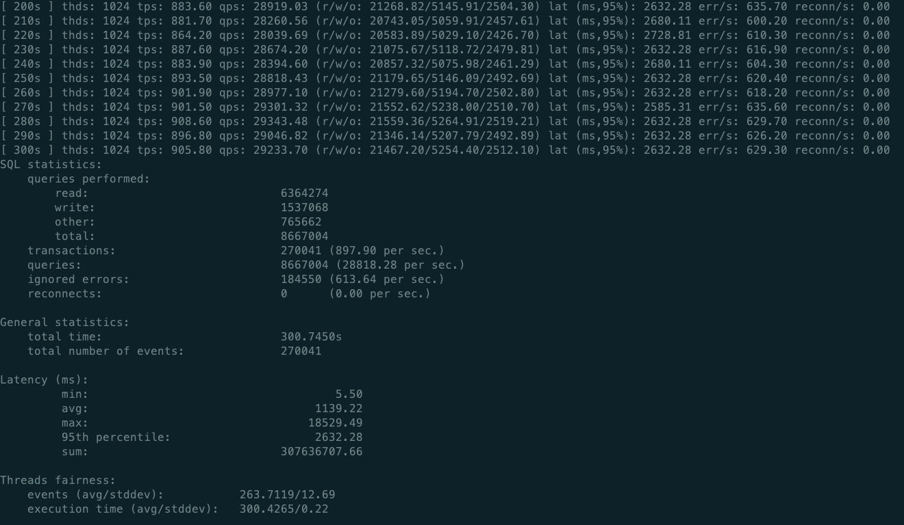

总体参考：

[https://zhuanlan.zhihu.com/p/60632693](https://zhuanlan.zhihu.com/p/60632693)

**方案：**

基于Percona Xtradb Cluster Docker来部署mysql节点，同样基于Docker 来部署keepalived + haproxy节点，实现mysql主主环形结构的负载均衡。

本次测试 mysql节点部署9个，haproxy节点两个，在宿主机上部署keepalived实现负载均衡。

本次测试环境是centos7。

## 1、环境准备
首先先在机器上安装并启动docker，最好是安装高版本docker，yum源里的一般比较老了，不建议用，高版本安装可以自行解决。

然后从Docker Hub中pull下需要的image。

**PXC：**

docker pull percona/percona-xtradb-cluster:5.7.21   （我这边环境用lastest版本有bug，所以用了5.7.21版本）

**keepalived + haproxy：**

docker pull pelin/haproxy-keepalived    (haproxy与keepalived合在同一个docker image中)

NOTE：pull下来的image里面mysql参数是默认参数，性能不高，需要修改参数（包括mysql、sysctl、ulimit参数），我这边以官方image为基础，run起来后exec进去，修改mysql配置文件node.cnf，然后commit出一个自己的image，tag是optimizev3（docker的相关操作这里不细说，自行解决）

## 2、部署
* mysql docker节点部署

写了一个脚本，一步创建全部九个节点。脚本如下(可根据实际情况自行修改脚本)：

```
#!/bin/bash
echo "创建网络"
docker network create  --subnet=172.18.0.0/24 pxc_net

echo "创建5个docker卷"
docker volume create v1
docker volume create v2
docker volume create v3
docker volume create v4
docker volume create v5
docker volume create v6
docker volume create v7
docker volume create v8
docker volume create v9

echo "创建节点 node1"
docker run -d -p 23306:3306  --net=pxc_net --name=node1 \
        -e CLUSTER_NAME=PXC \
        -e MYSQL_ROOT_PASSWORD=a123456 \
        -e XTRABACKUP_PASSWORD=a123456 \
        -v v1:/var/lib/mysql \
        --privileged \
        --ip 172.18.0.2 \
        percona/percona-xtradb-cluster:optimizev3
sleep 1m
echo "创建节点 node2"
docker run -d -p 23307:3306  --net=pxc_net --name=node2 \
        -e CLUSTER_NAME=PXC \
        -e MYSQL_ROOT_PASSWORD=a123456 \
        -e XTRABACKUP_PASSWORD=a123456 \
        -e CLUSTER_JOIN=node1 \
        -v v2:/var/lib/mysql \
        --privileged \
        --ip 172.18.0.3 \
        percona/percona-xtradb-cluster:optimizev3
sleep 20s
echo "创建节点 node3"
docker run -d -p 23308:3306  --net=pxc_net --name=node3 \
        -e CLUSTER_NAME=PXC \
        -e MYSQL_ROOT_PASSWORD=a123456 \
        -e XTRABACKUP_PASSWORD=a123456 \
        -e CLUSTER_JOIN=node1 \
        -v v3:/var/lib/mysql \
        --privileged \
        --ip 172.18.0.4 \
        percona/percona-xtradb-cluster:optimizev3
sleep 20s
echo "创建节点 node4"
docker run -d -p 23309:3306  --net=pxc_net --name=node4 \
        -e CLUSTER_NAME=PXC \
        -e MYSQL_ROOT_PASSWORD=a123456 \
        -e XTRABACKUP_PASSWORD=a123456 \
        -e CLUSTER_JOIN=node1 \
        -v v4:/var/lib/mysql \
        --privileged \
        --ip 172.18.0.5 \
        percona/percona-xtradb-cluster:optimizev3
sleep 20s
echo "创建节点 node5"
docker run -d -p 23310:3306  --net=pxc_net --name=node5 \
        -e CLUSTER_NAME=PXC \
        -e MYSQL_ROOT_PASSWORD=a123456 \
        -e XTRABACKUP_PASSWORD=a123456 \
        -e CLUSTER_JOIN=node1 \
        -v v5:/var/lib/mysql \
        --privileged \
        --ip 172.18.0.6 \
        percona/percona-xtradb-cluster:optimizev3
echo "创建节点 node6"
docker run -d -p 23311:3306  --net=pxc_net --name=node6 \
        -e CLUSTER_NAME=PXC \
        -e MYSQL_ROOT_PASSWORD=a123456 \
        -e XTRABACKUP_PASSWORD=a123456 \
        -e CLUSTER_JOIN=node1 \
        -v v6:/var/lib/mysql \
        --privileged \
        --ip 172.18.0.7 \
        percona/percona-xtradb-cluster:optimizev3
sleep 20s
echo "创建节点 node7"
docker run -d -p 23312:3306  --net=pxc_net --name=node7 \
        -e CLUSTER_NAME=PXC \
        -e MYSQL_ROOT_PASSWORD=a123456 \
        -e XTRABACKUP_PASSWORD=a123456 \
        -e CLUSTER_JOIN=node1 \
        -v v7:/var/lib/mysql \
        --privileged \
        --ip 172.18.0.8 \
        percona/percona-xtradb-cluster:optimizev3
sleep 20s
echo "创建节点 node8"
docker run -d -p 23313:3306  --net=pxc_net --name=node8 \
        -e CLUSTER_NAME=PXC \
        -e MYSQL_ROOT_PASSWORD=a123456 \
        -e XTRABACKUP_PASSWORD=a123456 \
        -e CLUSTER_JOIN=node1 \
        -v v8:/var/lib/mysql \
        --privileged \
        --ip 172.18.0.9 \
        percona/percona-xtradb-cluster:optimizev3
sleep 20s
echo "创建节点 node9"
docker run -d -p 23314:3306  --net=pxc_net --name=node9 \
        -e CLUSTER_NAME=PXC \
        -e MYSQL_ROOT_PASSWORD=a123456 \
        -e XTRABACKUP_PASSWORD=a123456 \
        -e CLUSTER_JOIN=node1 \
        -v v9:/var/lib/mysql \
        --privileged \
        --ip 172.18.0.10 \
        percona/percona-xtradb-cluster:optimizev3

echo "集群创建成功，包括9个节点"
```

* haproxy+keepalived docker节点部署

写了一个脚本，一键部署（可根据实际情况自行修改脚本），部署之前需要先去任一个mysql节点上创建一个用户，用于心跳检测，如下：CREATE user 'haproxy'@'%' IDENTIFIED BY '';

```
#! /bin/bash
echo "create volume"
docker volume create haproxy1
docker volume create haproxy2
docker volume create keep1
docker volume create keep2

echo "copy config file"
cp haproxy.cfg /var/lib/docker/volumes/haproxy1/_data/
cp haproxy.cfg /var/lib/docker/volumes/haproxy2/_data/
cp keepalived.conf /var/lib/docker/volumes/keep1/_data/
cp keepalived.conf /var/lib/docker/volumes/keep2/_data/

echo "create haproxy1"
docker run -idt -p 4001:8888 -p 4002:3306 -v haproxy1:/usr/local/etc/haproxy -v keep1:/etc/keepalived --name haproxy-keep1 --privileged --net=pxc_net --ip=172.18.0.11 pelin/haproxy-keepalived
sleep 20

echo "create haproxy2"
docker run -idt -p 4003:8888 -p 4004:3306 -v haproxy2:/usr/local/etc/haproxy -v keep2:/etc/keepalived --name haproxy-keep2 --privileged --net=pxc_net --ip=172.18.0.12 pelin/haproxy-keepalived

echo "haproxy-keep done"
```
上面脚本中需要复制两个配置文件到docker中，这俩文件内容如下(均需根据实际情况自行修改)：
haproxy.cfg

```
global
    #工作目录
    chroot /usr/local/etc/haproxy
    #日志文件，使用rsyslog服务中local5日志设备（/var/log/local5），等级info
    log 127.0.0.1 local5 info
    #守护进程运行
    daemon

defaults
    log global
    mode    http
    #日志格式
    option  httplog
    #日志中不记录负载均衡的心跳检测记录
    option  dontlognull
    #连接超时（毫秒）
    timeout connect 5000
    #客户端超时（毫秒）
    timeout client  50000
    #服务器超时（毫秒）
    timeout server  50000

#监控界面
listen  admin_stats
    #监控界面的访问的IP和端口
    bind  0.0.0.0:8888
    #访问协议
    mode        http
    #URI相对地址
    stats uri   /dbs
    #统计报告格式
    stats realm     Global\ statistics
    #登陆帐户信息
    stats auth  admin:a123456
#数据库负载均衡
listen  proxy-mysql
    #访问的IP和端口
    bind  0.0.0.0:3306
    #网络协议
    mode  tcp
    #负载均衡算法（轮询算法）
    #轮询算法：roundrobin
    #权重算法：static-rr
    #最少连接算法：leastconn
    #请求源IP算法：source
    balance  roundrobin
    #日志格式
    option  tcplog
    #在MySQL中创建一个没有权限的haproxy用户，密码为空。Haproxy使用这个账户对MySQL数据库心跳检测
    option  mysql-check user haproxy
    server  MySQL_1 172.18.0.2:3306 check weight 1 maxconn 20000
    server  MySQL_2 172.18.0.3:3306 check weight 1 maxconn 20000
    server  MySQL_3 172.18.0.4:3306 check weight 1 maxconn 20000
    server  MySQL_4 172.18.0.5:3306 check weight 1 maxconn 20000
    server  MySQL_5 172.18.0.6:3306 check weight 1 maxconn 20000
    server  MySQL_6 172.18.0.7:3306 check weight 1 maxconn 20000
    server  MySQL_7 172.18.0.8:3306 check weight 1 maxconn 20000
    server  MySQL_8 172.18.0.9:3306 check weight 1 maxconn 20000
    server  MySQL_9 172.18.0.10:3306 check weight 1 maxconn 20000
    #使用keepalive检测死链
    option  tcpka
```

keepalived.conf

```
vrrp_instance  VI_1 {
    state  MASTER
    interface  eth0
    virtual_router_id  51
    priority  100
    advert_int  1
    authentication {
        auth_type  PASS
        auth_pass  123456
    }
    virtual_ipaddress {
        172.18.0.201
    }

}
```

* 部署宿主机keepalived

```
yum -y install keepalived
```

然后将/etc/keepalived/keepalived.conf 文件内容修改为如下：

```
vrrp_instance VI_1 {
        state MASTER
        interface ens1f0
        virtual_router_id 51
        priority 100
        advert_int 1
        authentication {
            auth_type PASS
            auth_pass 123456
        }
        virtual_ipaddress {
            192.168.125.253
        }
    }

virtual_server 192.168.125.253 8888 {
        delay_loop 3
        lb_algo rr
        lb_kind NAT
        persistence_timeout 50
        protocol TCP

        real_server 172.18.0.201 8888 {
            weight 1
        }
    }

    virtual_server 192.168.125.253 3306 {
        delay_loop 3
        lb_algo rr
        lb_kind NAT
        persistence_timeout 50
        protocol TCP

        real_server 172.18.0.201 3306 {
            weight 1
        }
    }
```

然后宿主机启动keepalived

```
service keepalived start
```

以上，集群基本部署完成，我们可以通过vip:8888/dbs看到所有mysql节点的监控。
## 3、压测
### 机械硬盘+普通网卡
1024threads,如下，I/O是瓶颈，其余CPU、Memory等使用率很低，网络看起来也还好。整体性能略低于单节点mysql。

结果：tps：270/s，qps：12751/s，errors：401/s，95%latency：10343ms



### SSD硬盘+82599光模块
1024threads，300s，如下,性能明显低于单节点mysql。

结果：tps：897/s，qps：28818/s，errors：613/s，95%latency：2632ms



