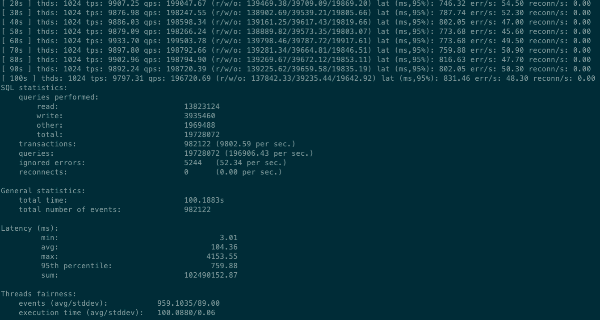

主要参考：[https://www.jianshu.com/p/4876a0aab3e8](https://www.jianshu.com/p/4876a0aab3e8)

## 1、环境准备
准备两台主机，分别安装mysql（mysql版本最好保持一致）

## 2、部署
### 部署Master
* 修改配置

mysql配置文件my.cnf中自行调优，然后在此基础上添加如下：

```
## 设置server_id，一般设置为IP,注意要唯一
server_id=100
## 复制过滤：也就是指定哪个数据库不用同步（mysql库一般不同步）
binlog-ignore-db=mysql
## 开启二进制日志功能，可以随便取，最好有含义（关键就是这里了）
log-bin=mysql-bin
## 为每个session 分配的内存，在事务过程中用来存储二进制日志的缓存
binlog_cache_size=16M
## 主从复制的格式（mixed,statement,row，默认格式是statement）
binlog_format=mixed
## 二进制日志自动删除/过期的天数。默认值为0，表示不自动删除。
expire_logs_days=30
## 跳过主从复制中遇到的所有错误或指定类型的错误，避免slave端复制中断。
## 如：1062错误是指一些主键重复，1032错误是因为主从数据库数据不一致
slave_skip_errors=1062
```

然后重启mysql。

* 创建同步用户


```
CREATE USER 'slave'@'%' IDENTIFIED BY 'a123456';

GRANT REPLICATION SLAVE, REPLICATION CLIENT ON *.* TO 'slave'@'%';
```

这里主要是要授予用户REPLICATION SLAVE权限和REPLICATION CLIENT权限。
### 部署Slave
* 修改配置

mysql配置文件my.cnf中自行调优，然后在此基础上添加如下：

```
[mysqld]
## 设置server_id，一般设置为IP,注意要唯一
server_id=101
## 复制过滤：也就是指定哪个数据库不用同步（mysql库一般不同步）
binlog-ignore-db=mysql
## 开启二进制日志功能，以备Slave作为其它Slave的Master时使用
log-bin=mysql-slave1-bin
## 为每个session 分配的内存，在事务过程中用来存储二进制日志的缓存
binlog_cache_size=16M
## 主从复制的格式（mixed,statement,row，默认格式是statement）
binlog_format=mixed
## 二进制日志自动删除/过期的天数。默认值为0，表示不自动删除。
expire_logs_days=30
## 跳过主从复制中遇到的所有错误或指定类型的错误，避免slave端复制中断。
## 如：1062错误是指一些主键重复，1032错误是因为主从数据库数据不一致
slave_skip_errors=1062
## relay_log配置中继日志
relay_log=mysql-relay-bin
## log_slave_updates表示slave将复制事件写进自己的二进制日志
log_slave_updates=1
## 防止改变数据(除了特殊的线程)
read_only=1
```

然后重启mysql。

* 完成Master和Slave链接

首先要保证除去skip的不同步数据库外，其他数据库保持一致。

然后登录master执行，这个结果后面要用，保留（File列和Position列的值）：

```
show master status;
```
再登录slave，执行：

```
change master to master_host='172.17.0.1', master_user='slave', master_password='a123456', master_port=3306, master_log_file='mysql-bin.000001', master_log_pos=1389, master_connect_retry=30;
```

上面执行的命令的解释：

> master_host='172.17.0.1' ## Master的IP地址

> master_user='slave' ## 用于同步数据的用户（在Master中授权的用户）

> master_password='a123456' ## 同步数据用户的密码

> master_port=3306 ## Master数据库服务的端口

> master_log_file='mysql-bin.000001' ##指定Slave从哪个日志文件开始读复制数据（Master上执行命令的结果的File字段）

> master_log_pos=1389 ## 从哪个POSITION号开始读（Master上执行命令的结果的Position字段）

> master_connect_retry=30 ##当重新建立主从连接时，如果连接建立失败，间隔多久后重试。单位为秒，默认设置为60秒，同步延迟调优参数。

* 查看主从同步状态


```
在Slave中执行命令：
show slave status;
```

可看到Slave_IO_State为空， Slave_IO_Running和Slave_SQL_Running是No，表明Slave还没有开始复制过程。相反Slave_IO_Running和Slave_SQL_Running是Yes表明已经开始工作了
 

* 开启主从同步


```
在Slave中执行命令：
start slave;
```

查询查看主从同步状态，会发现Slave_IO_Running和Slave_SQL_Running是Yes了，表明开启成功。
## 3、压测
### SSD硬盘+82599光模块
1024threads，300s，如下,性能略微低于单节点mysql，大概下降8%左右。

结果：tps：9802/s，qps：196986/s，errors：52/s，95%latency：759ms



